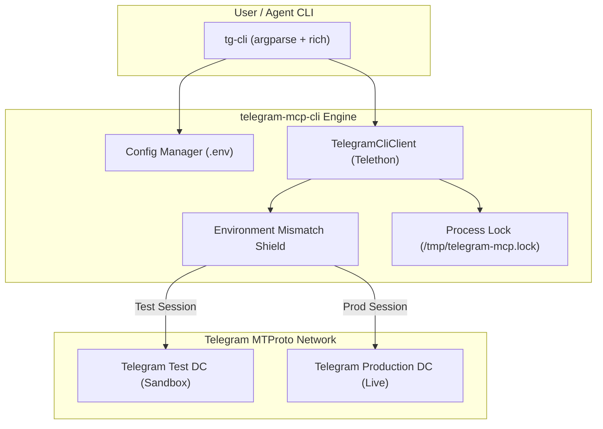

<div align="center">

# ⚡ telegram-mcp-cli

### Modern Command-Line Interface & Bot Automation Controller for Telegram

[](https://www.python.org/)
[](https://opensource.org/licenses/MIT)
[](https://github.com/LonamiWebs/Telethon)
[](https://docs.pytest.org/)

<p align="center">
  <b>Interact with, test, and automate Telegram bots directly from your terminal.</b><br>
  Built on MTProto with direct Telethon <code>.session</code> file support, automatic environment detection, and session protection.
</p>

</div>

---

## 📑 Table of Contents
- [✨ Key Features](#-key-features)
- [🏗️ Architecture](#️-architecture)
- [🚀 Quick Start](#-quick-start)
- [💻 Command Reference](#-command-reference)
- [🛡️ Safety & Session Protection](#️-safety--session-protection)
- [🧪 Testing](#-testing)
- [📄 License](#-license)

---

## ✨ Key Features

* 🔑 **Instant Session Switching (`tg-cli auth <path.session>`)**: Pass any existing Telethon `.session` file directly. Automatically validates SQLite integrity, detects the target server cluster, and aligns settings.
* 🤖 **Bot Testing & Automation**: Send text payloads, trigger slash commands (e.g. `/start`), inspect responses, and click inline keyboard buttons.
* 🛡️ **Environment Mismatch Shield**: Automatically detects whether your session belongs to the **Test Server** (Sandbox) or **Production Server** and protects against cross-environment auth revocation.
* 🔒 **Process-Level Session Guard**: Prevents concurrent duplicate connections (`/tmp/telegram-mcp.lock`) to eliminate `AuthKeyDuplicatedError`.
* 📁 **Rich Terminal Display**: Colorized output, message panels, button trees, and clean tabular diagnostics powered by `rich`.
* ⚡ **Arbitrary MTProto Execution (`tg-cli exec`)**: Direct command-line evaluation of Python MTProto snippets with live client injection.

---

## 🏗️ Architecture



---

## 🚀 Quick Start

### 1. Installation

```bash
git clone https://github.com/Telegram-mcp/telegram-mcp-cli.git
cd telegram-mcp-cli
pip install -e .
```

### 2. Configure Authentication

> [!TIP]
> If you already have a `telegram-mcp` installation at `/root/bot-mcp`, `tg-cli` automatically detects and shares credentials from its `.env`!

To set up or switch active sessions directly:

```bash
# Option A: Point to an existing Telethon .session file
tg-cli auth /path/to/my_account.session

# Option B: Run interactive phone / QR login
tg-cli auth login
```

### 3. Verify Connection

```bash
tg-cli status
```

---

## 💻 Command Reference

| Command | Description | Example |
| :--- | :--- | :--- |
| `auth` | Configure active session file or login | `tg-cli auth my_bot.session` |
| `status` | View connection, DC, and account status | `tg-cli status` |
| `send` | Send formatted text message to a bot/chat | `tg-cli send @mybot "Hello from CLI"` |
| `command` | Send `/command` and wait for bot reply | `tg-cli command @mybot /start` |
| `click` | Click inline button by text or index | `tg-cli click @mybot --button "Option 1"` |
| `history` | Fetch recent conversation history | `tg-cli history @mybot --limit 10` |
| `send-file` | Upload photo, document, or audio | `tg-cli send-file @mybot doc.pdf` |
| `exec` | Execute MTProto Python snippet | `tg-cli exec "await client.get_me()"` |

---

## 🛡️ Safety & Session Protection

> [!WARNING]
> Telegram permanently revokes authorization keys if multiple processes connect with the same session key simultaneously (`AuthKeyDuplicatedError`).

* **File Locking**: `tg-cli` uses `/tmp/telegram-mcp.lock` to ensure no two processes use the session concurrently.
* **Environment Matching**: Test Server sessions (DC 2 Sandbox) and Production sessions cannot be cross-connected. The CLI will abort with a clear warning before Telegram revokes the key.

---

## 🧪 Testing

Run the automated unit test suite with `pytest`:

```bash
python3 -m pytest tests -v
```

---

## 📄 License

This project is licensed under the [MIT License](LICENSE).
